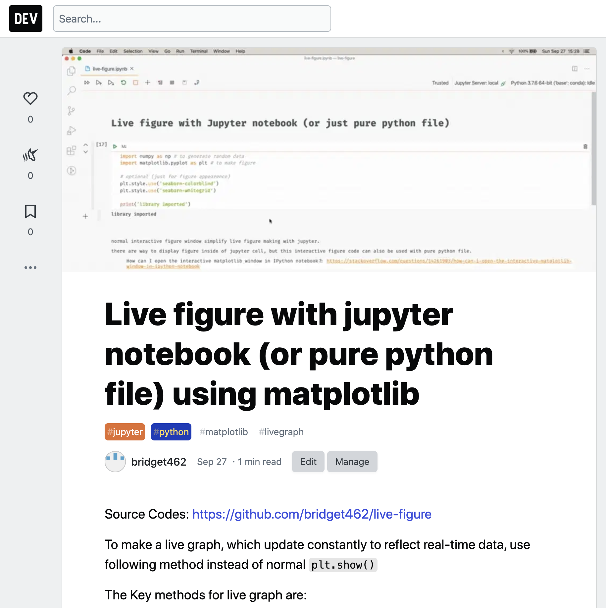

# Live figure with jupyter notebook (or pure python file) using matplotlib

For detailed explanation, visit DEV article: https://dev.to/bridget462/live-figure-with-jupyter-notebook-or-pure-python-file-using-matplotlib-46dn

- Check `live-figure.ipynb` for jupyter notebook version
- Check `live-figure.py` for python file version

